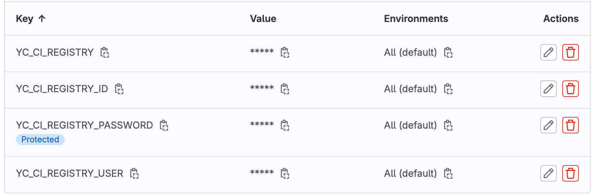
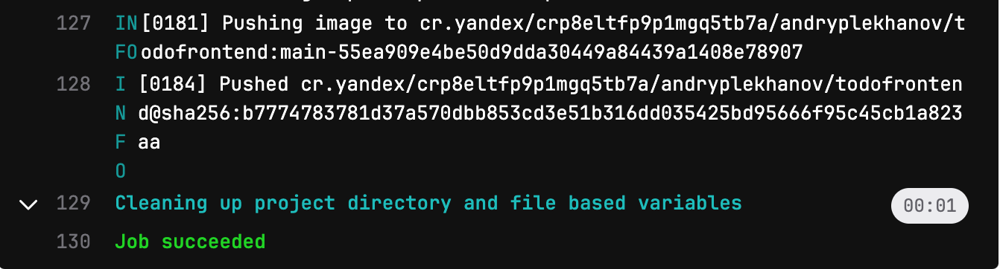

# Разворачиваем TodoApp по модели GitOps

## Этап 1 — Подготовка

### Подготовка репозиториев с приложениями

Клонируем в свой Gitlab следующие репозитории:
- репо с данным приложением **yc-gitops1**
- репо с [фронтэнд-сервисом](https://github.com/yandex-cloud-examples/yc-courses-devops-course2/tree/master/todofrontend) приложения **todofrontend**
- репо с [бэкэнд-сервисом](https://github.com/yandex-cloud-examples/yc-courses-devops-course2/tree/master/todobackend) приложения **todobackend**


### Подготовка ПК или ВМ

На вашем ПК или ВМ должны быть установлены утилиты: terraform, kubectl, Helm, helm-secrets plugin, YandexCloud CLI, sops, age.

**Для их автоматической установки на Ubuntu 22-04:**
- клонируйте данный репозиторий и перейдите в проект
- дайте права на исполнение: `chmod +x prepare.sh`
- запустите скрипт: `./prepare.sh`

### Подготовка YandexCloud

_Данный этап я не стал автоматизировать, поскольку действия связанные с регистрацией домена и выдачей сертификата могут занять продолжительное время, поэтому лучше всё это проделать заранее._

- В Yandex Cloud должно быть создано облако с дефолтными **folder**, **network** и **subnets** (3 шт.: в зонах ru-central1-a, b и d)
- В Yandex Cloud в дефолтном **folder** должны быть созданы:
  - Публичный статический IP-адрес
  - DNS зона (публичная), например `andreiplekhanov.ru.`
  - В этой зоне: запись типа A, например `*.andreiplekhanov.ru.`, указывающая на ранее созданный IP.
  - Сертификат от **Let’s Encrypt** и **CNAME** запись к ранее созданному домену.

## Этап 2 — Разворачиваем зональный кластер k8s

- Переходим в папку terraform: `cd terraform`
- В Yandex Cloud берём **network id** и **subnet ids** (3 шт.: в зонах ru-central1-a, b и d). Вставляем их в `variables.tf` в **yc_network_id** и **yc_subnet_ids**.
- Инициализируем terraform: `terraform init`
- В Yandex Cloud берём **cloud id**, **folder id**, **token**. Вставляем их между кавычками в команду ниже.
- Также придумываем и запоминаем данные для БД PostgreSQL и вписываем в команду ниже.
- Применяем: 

```bash
terraform apply \
 -var yc_cloud="" \
 -var yc_folder="" \
 -var yc_token="" \
 -var user="" \
 -var db_name="" \
 -var db_username="" \
 -var db_password=""
```
- Получаем результат:

```
Outputs:

k8s_cluster_id = "cate0ugm3ubsq2iana7f"
container_registry_id = "crplq85o3ts2puflph5j"
security_group_id = "enpmbs0454vsg2vjtida"
postgres_cluster_id = "c9qr4lslh65aha2o56q1"
```

- переходим в папку с чартами: `cd ../helm`
- подключаемся к кластеру: `yc managed-kubernetes cluster get-credentials --name=kube-infra --external --force`
- для сервисных аккаунтов создаем ключи (пригодятся позже):
  - для **ingress-controller**: `yc iam key create --service-account-name ingress-controller --output ingress-sa-key.json`
  - для **registry-puller**: `yc iam key create --service-account-name registry-puller --output reg-puller-sa-key.json`
  - для **registry-pusher**: `yc iam key create --service-account-name registry-pusher --output reg-pusher-sa-key.json`


## Этап 3 — Настраиваем Gitlab

### Разворачиваем в кластере runner

- заходим на Gitlab в данный проект (с helm-чартами) и идём в **Settings**
- в разделе **Access Tokens** создаём токен с ролью **Developer** и разрешением **Read repository**. Запоминаем его. Он нам пригодится далее.
- в разделе **CI/CD** идём в **Runners** и создаём раннер. Подставляем полученный token и URL в команду ниже и выполняем её:

```
helm install gitlab-runner charts/gitlab-runner \
  --set gitlabUrl=<runner URL> \
  --set runnerRegistrationToken=<runner token> \
  --set rbac.create=true \
  --namespace gitlab \
  --create-namespace
```

### Настраиваем CI в репозиториях с микросервисами

- заходим на Gitlab в проекты с приложениями (в каждый) и идём в **Settings** -> **CI/CD**
- идём в **Runners** и подключаем ранее созданный раннер.
- идём в **Variables** и создаём переменные:
  - YC_CI_REGISTRY: cr.yandex
  - YC_CI_REGISTRY_ID: <указываем наш container_registry_id>
  - YC_CI_REGISTRY_PASSWORD: <содержимое файла reg-pusher-sa-key.json>
  - YC_CI_REGISTRY_USER: json_key



- запускаем джобу **build**, ждём успешного выполнения и смотрим результат:



- отсюда запоминаем 2 вещи:
  - **адрес реджистри-репозитория** `cr.yandex/crp8eltfp9p1mgq5tb7a/andryplekhanov/todofrontend`
  - **тэг сборки** `main-55ea909e4be50d9dda30449a84439a1408e78907`
- В Yandex Cloud идём в наш **Container Registry** и убеждаемся, что наш образ загрузился и находится в статусе **Active**.


## Этап 4 — Разворачиваем приложения

### Создаём секретный ключ

- создаём неймспейс: `kubectl create namespace argocd`
- генерим ключ: `age-keygen -o key.txt`
- экспортируем переменные:
  - `export SOPS_AGE_KEY_FILE=$(pwd)/key.txt`
  - `export SOPS_AGE_RECIPIENTS=<публичный ключ, который распечатала команда выше>`
- создаем Secret внутри кластера: `kubectl -n argocd create secret generic helm-secrets-private-keys --from-file=key.txt`

### Разворачиваем в кластере Argocd и App of apps

- из папки `values/templates` переносим файлы в папку `values` и меняем у них расширение на **.yaml**
- редактируем файлы в папке `values`. Вписываем параметры везде, где встречаются угловые скобки **<some_data>**
- зашифровываем их, например: `helm secrets enc values/argocd.yaml`
- устанавливаем Argocd в кластер: `helm secrets -n argocd upgrade --install argocd charts/argo-cd -f values/argocd.yaml`
- добавляем репо в helm: `helm repo add argo https://argoproj.github.io/argo-helm`
- устанавливаем **App of apps** из репо: `helm secrets -n argocd upgrade --install argocd-apps argo/argocd-apps -f values/argocd-apps.yaml`
- всё коммитим и пушим в Gitlab
- минут через 10-15, когда поднимется балансировщик, можем зайти на наш Argocd по адресу `https://argocd.<ваш домен>`
  - логин **admin**, 
  - пароль узнать командой `kubectl -n argocd get secret argocd-initial-admin-secret -o jsonpath="{.data.password}" | base64 -d; echo`